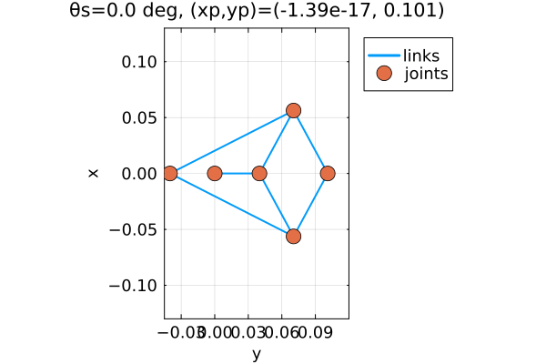
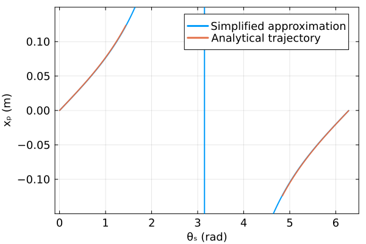
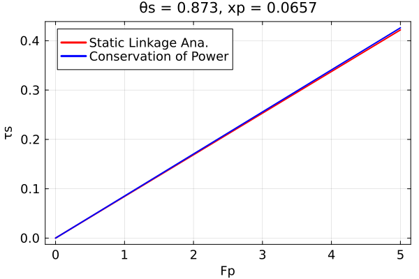
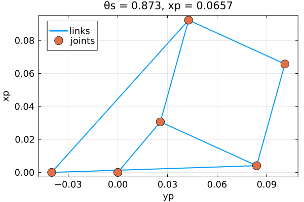
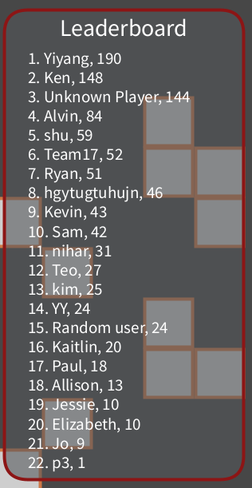

# Haptic Brick Breaker

**Stanford ME327 — Design and Control of Haptic Systems, Spring 2025**

**Team 17:** Saimai Lau, Yiyang Wang, Zhangying Xu, Qianhe Ye

A 2-DOF haptic brick-breaker game built on the Hapkit platform. Players control a physical paddle that provides real-time force feedback — including spring forces, impact jolts, and vibration effects — while playing an on-screen breakout-style game rendered in Processing.

[Project Page](https://charm.stanford.edu/ME327/2025-Group17)



## What Makes It Unique

Most haptic paddle systems offer only 1-DOF horizontal translation. Our system adds a second degree of freedom — **paddle rotation** (up to ±45°) — letting players angle the paddle for finer control over ball bounce direction. This is achieved through a dual-motor, dual-encoder architecture driving an 8-bar Peaucellier-Lipkin linkage mechanism.

## System Architecture

```
  Processing (Game + Physics)
        ↕ Serial @ 115200 baud
  ┌─────────────────────────────────┐
  │  Arduino Board 1 (Hapkit #1)    │──── Encoder 1 (linkage angle)
  │  Reads encoders, computes       │──── Encoder 2 (drum angle)
  │  paddle position & angle        │
  └─────────────────────────────────┘
  ┌─────────────────────────────────┐
  │  Arduino Board 2 (Hapkit #2)    │──── Motor 1 (horizontal force)
  │  Receives force commands,       │──── Motor 2 (rotational torque)
  │  drives motors + vibromotor     │──── Vibromotor (impact feedback)
  └─────────────────────────────────┘
        ↕
  Physical Hapkit Paddle (2-DOF)
```

Two Hapkit boards are used because a single board only has 2 interrupt pins and 1 motor driver — insufficient for simultaneous 2-encoder + 2-motor control.

## Mechanical Design

### Peaucellier-Lipkin Linkage

The paddle's horizontal translation is driven by an **8-bar Peaucellier-Lipkin linkage**, which converts motor rotation into near-perfect linear motion with a larger workspace than simpler 4-bar alternatives.

| Parameter | Value | Description |
|-----------|-------|-------------|
| `Ll` | 0.124 m | Long link length |
| `Lb` | 0.04 m | Base link length |
| `Ls` | 0.064 m | Short link length |
| `Rs` | 0.04 m | Sector pulley radius |
| `L0` | 0.14 m | Reference length |

Full closed-form kinematics are derived in [`linkage.jl`](linkage.jl), along with a simplified linear approximation:

```
x_paddle = L0 * sin(theta_s) / (1 + cos(theta_s))
```

The simplified model closely matches the full analytical solution within the operating range:



### Force Analysis

Motor torque is computed from desired paddle force using conservation of virtual power. The analytical and simplified models show strong agreement:



### Linkage Geometry Verification



### Pulley System

A drum pulley connected to a second motor provides paddle rotation. Calibration (in [`pulleyCalibration.jl`](pulleyCalibration.jl)) maps motor encoder counts to paddle angle with an empirical correction factor of ~184.98 rad/m.

## Haptic Rendering

### Proxy-Based Ball Contact

Rather than simple virtual walls, we implement a **proxy contact point** algorithm:

1. When the ball penetrates the paddle, a virtual "proxy" point is created on the paddle surface
2. A spring force (`k = 600 N/m`) pulls the ball toward the proxy: `F = -k * (ball_pos - proxy_pos)`
3. The proxy stays on the paddle boundary, providing smooth force transitions
4. All forces are computed in the paddle's body frame (accounting for rotation), then transformed back to the world frame

This approach eliminates force discontinuities and prevents the ball from "sticking" to the paddle.

### Haptic Effects

| Effect | Trigger | Implementation |
|--------|---------|----------------|
| **Spring trap** | Near screen edges | Resistive spring force (`k = 30 N/m`) |
| **Impact jolt** | Ball hits paddle | Vibromotor pulse (alternating polarity every 25 cycles) |
| **Brick feedback** | Ball breaks brick | Haptic effect varies by brick type (0–3) |

### Motor Nonlinearity Compensation

The motor torque-to-duty-cycle relationship is nonlinear (`tau = K * duty^2`). We linearize the output with:

```
duty = sqrt(|tau| / K),  where K = 0.0453
```

## Game Design

The Processing game features:
- **Ball physics** with semi-implicit Euler integration at 100 Hz
- **Procedurally generated brick layouts** (20% fill probability per cell)
- **Circle-rectangle collision detection** for paddle, bricks, and walls
- **Persistent leaderboard** saved to file across sessions
- Real-world coordinate system (0.2 m × 0.2 m play area) mapped to a 1200 × 1200 px window

## Repository Structure

```
.
├── hapticMinigame/                 # Processing game (main application)
│   ├── hapticMinigame.pde          # Game loop, physics, serial I/O
│   ├── Player.java                 # Paddle: collision, proxy forces, frame transforms
│   ├── Bricks.java                 # Brick grid: generation, collision, effects
│   ├── LeaderBoard.java            # Score persistence & ranking
│   ├── TEXTBOX.pde                 # Player name input UI
│   └── ledbrd.txt                  # Saved leaderboard data
├── projectCode1/                   # Final Arduino firmware (dual motor/encoder)
│   └── projectCode1.ino            # Position reading + force/torque output
├── hapticMinigamArduino/           # Legacy single-motor Arduino code
│   └── hapticMinigamArduino.ino
├── motorCharacterization/          # Motor calibration & testing
│   └── motorCharacterization.ino
├── linkage.jl                      # Linkage kinematics analysis (Julia)
├── pulleyCalibration.jl            # Pulley angle calibration (Julia)
└── *.png, *.gif                    # Analysis plots & animations
```

## Demo Day Results

22 players competed during the demo. The haptic feedback — especially the impact jolts and edge spring traps — kept players coming back for multiple rounds.



## Hardware

- 2x Maxon 118743 DC motors with HEDS 5540 encoders
- 2x Hapkit boards
- 1x Vibromotor (mounted on paddle)
- 3D-printed linkage components (0.19" thickness)
- Laser-cut acrylic housing
- Bearings and shafts for low-friction joints

## Running the Code

1. **Arduino:** Upload `projectCode1/projectCode1.ino` to both Hapkit boards (adjust pin assignments per board)
2. **Processing:** Open `hapticMinigame/hapticMinigame.pde` in the Processing IDE
3. **Serial:** Ensure the correct serial port indices in `hapticMinigame.pde` match your system (`Serial.list()`)
4. **Julia (optional):** Run `linkage.jl` or `pulleyCalibration.jl` for kinematics analysis (requires `Plots` and `LinearAlgebra` packages)
